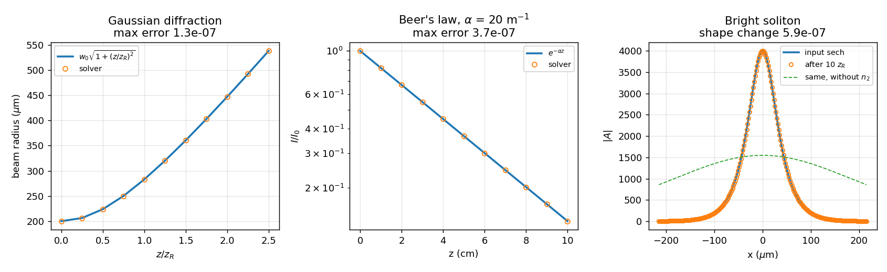

# Physical validation

Most of a solver's test suite can pass while the physics is wrong. Tests that
compare the backends against each other pass when all of them are wrong in the
same way. Tests that measure convergence order pass when the answer converges
beautifully to the wrong number — order is a statement about how the error
*shrinks*, not about what it shrinks towards. And a test that checks the
propagator by writing the same formula a second time and comparing catches a
typo in one of the two copies, never the formula itself.

So there is a separate suite, `tests/physics/test_closed_forms.py`, whose
assertions come from outside the package: solutions of the same equation that
were known before this code existed. Each one isolates a different term, and
the last one isolates none of them.

Curves are the analytic solutions, markers are what the solver returns. The
residuals in the titles are what the figure cannot show.

## The equation, and the conventions it fixes

$$
i\frac{\partial A}{\partial z}
  = -\frac{1}{2k}\nabla^2 A
  - k\,n_2\,\frac{I}{1 + I/I_{sat}}\,A,
\qquad I = \frac{c\varepsilon_0}{2}|A|^2
$$

Two conventions follow from it that nothing else in the documentation stated,
and that the tests now pin:

- **$n_2 > 0$ is self-focusing.** A positive nonlinear index raises the index
  where the beam is brightest, which is what makes the bright soliton below
  exist at that sign and not the other.
- **`alpha` attenuates the intensity**, not the amplitude: $I = I_0e^{-\alpha z}$.
  A factor of two here is invisible to every other kind of test.

## What each check isolates

| Check | Closed form | Isolates | Agreement |
|---|---|---|---|
| Gaussian diffraction | $w(z) = w_0\sqrt{1 + (z/z_R)^2}$, $z_R = kw_0^2/2$ | the propagator, its normalization, the $k$ grid, the wavelength | exact |
| Gouy phase | $\varphi(0,z) = -\arctan(z/z_R)$ | the *sign* and scale of the dispersion relation | 5 decimals |
| Talbot revival | $z_T = kd^2/\pi$ | the propagator at a finite transverse wavenumber | $1.6\times10^{-6}$ |
| Beer's law | $I(z) = I_0e^{-\alpha z}$ | the loss term, and its convention | 6 decimals |
| Saturated self-phase modulation | $\varphi = k n_2 I z / (1 + I/I_{sat})$ | the interaction term and the saturation model | $10^{-7}$ |
| The lossy identity | $\varphi = \dfrac{k n_2}{\alpha}\left(I_0 - I_{end}\right)$ | loss and interaction *together* | $4\times10^{-7}$ |
| Bright soliton | $x_0^2 = 1/(k g A_0^2)$, $g = kn_2c\varepsilon_0/2$ | nothing separately — only the balance | $6\times10^{-7}$ |

### Why three checks on the propagator

A beam diffracts at roughly the right rate under a surprising range of
mistakes, and a second moment is a blunt instrument. The Gouy phase is the
sharp one: flipping the sign of the dispersion operator still produces a
beam that spreads, and only the phase test notices. The Talbot distance
covers what neither can — both Gaussian tests concentrate their power near
$K = 0$, where a wrong dispersion relation hides, while a grating puts all of
it at one finite $K$ and revives only at the distance that $K^2/2k$ predicts.

### The lossy identity

This one is worth stating in full, because it is the physics behind the
solved real-space step rather than a property of the numerics. With
$y = |A|^2$ and $s = 1/(1 + y/I_{sat})$,

$$
\frac{\mathrm{d}y}{\mathrm{d}z} = -\alpha s y,
\qquad
\frac{\mathrm{d}\varphi}{\mathrm{d}z} = k n_2 y s
\qquad\Longrightarrow\qquad
\frac{\mathrm{d}\varphi}{\mathrm{d}y} = -\frac{k n_2}{\alpha}
$$

so the phase accumulated over any distance depends only on how much intensity
was lost, whatever the saturation did in between — and the intensity that
remains is fixed implicitly by $\ln I + I/I_{sat}$ falling by $\alpha z$. Both
halves are asserted. Elsewhere the suite measures the *order* of that step;
here it is measured against the answer.

### The soliton, and its control

$A_0\,\mathrm{sech}(x/x_0)$ propagates unchanged only when diffraction and
self-focusing cancel exactly. Every other check above passes if the two terms
are individually right; this is the one that fails if a sign or a factor sits
*between* them. It is asserted alongside a control — the same profile 1.5x too
wide, which is not a soliton and visibly spreads — because "the shape barely
changed" means nothing without something that changed.

## What breaking the physics does

The checks were verified by breaking the solver on purpose. Each mutation is a
plausible slip in a constant that no other test in the suite reads against
anything external:

| Injected fault | Caught by |
|---|---|
| dispersion off by a factor of two | diffraction, Gouy, Talbot |
| dispersion sign flipped | **Gouy only** |
| `alpha` applied whole instead of halved | Beer, the lossy identity |
| saturation off by a factor of two | Beer, the lossy identity |

## What this does not cover

- **Vortex dynamics.** A vortex–antivortex pair should translate at
  $v = \hbar/(md)$, which is the natural closed form for a periodic box since
  net circulation must vanish there. A first attempt reproduced it to 7% at
  one separation and not at two others; the initial state was not relaxed and
  the core positions came out quantized to the grid. Doing it properly needs
  imaginary-time relaxation and sub-pixel core fitting, and a test that passes
  at one separation is worse than none.
- **The absorbing potential and the coupled solvers.** Their real-space step is
  still frozen rather than solved, so it is first order in a lossy medium. That
  is a known limitation rather than an untested one — see the *Open* section of
  `docs/optimization-log.md`.
- **Whether the grid resolves your problem.** Every check here is
  self-consistent on its own grid. None of them says that the grid you chose is
  fine enough for the physics you are running.
